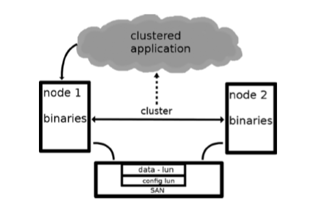

# Tổng quan về High Availability Cluster

___

# Mục lục

+ [Giới thiệu về High Availability](#whatis-ha)
+ [Các khái niệm, thuật ngữ cần biết trong HA](#concepts)
	+ [Cluster](#whatis-cl)
	+ [Resource](#resource)
	+ [Pacemaker](#pacemaker)
	+ [Corosync](#corosync)
	+ [Quorum](#quorum)
	+ [STONITH](#stonith)
	+ [Một vài thôn tin khác](#others-concept)
- [Các nội dung khác](#content-others)

___

# Nội dung

- <a name="whatis-ha">Giới thiệu về High Availability Cluster</a>

	- Mục đích của một HA (High Availability) cluster là đảm bảo rằng các tài nguyên quan trọng có thể được tận dụng một cách tối đa nhất có thể. Mục đích này được thực hiện bằng các cài đặt nhiều cluster software trên nhiều máy chủ. Các cluster software này theo dõi sự khả dụng của các node trong cluster.	Đòng thời giám sát sự khả dụng của các dịch vụ được quản lý bởi cluster như: File Share, File Storage, ... Nếu như các máy chủ này ngừng hoạt động hoặc các resource ngừng hoạt động thì ha cluster sẽ thông báo và đảm bảo rằng resource được khởi động lại ở một nơi nào đó trong cluster sao cho có thể sử dụng lại được resource đã ngừng hoạt động đó trong một khoảng thời gian tối thiểu.

	- Để xây dựng lên một HA Cluster, ta sẽ cần nhiều hơn một máy chủ được gắn với nhau. Thông thường, thành phần của một HA Cluster được xây dựng bao gồm:

		- Shared Storage

			+ Trong một cluster, đây là máy chủ được quy định dùng để chia sẻ resource. 
			+ Có  hướng triển khai cho Shared Storage đó là:

				- NFS: Network File System
				- SAN: Storage Area Network
				- NAS: Network Attached Storage

		- Different Networks 

			

			+ Một cluster nên có nhiều kết nối mạng

				- Đường mạng cho user, từ đó user có thể truy xuất tới cluster resource.
				- Đường mạng cho cluster, cần đảm bảo dự phòng cho đường này.
				- Đường mạng cho storage, cấu hình dựa vào loại thiết bị lưu trữ sử dụng.

		- Bonded Network Devices

			- Để kết nối cluster node tới các dải mạng, chỉ dùng 1 card mạng (NIC). Nếu NIC đó lỗi, node sẽ mất kết nối trên dải mạng đó.
			- Giải pháp là sử dụng network bonding. 1 network bond là một nhóm nhiều NIC. Thông thường, có 2 NIC trong 1 bond. Mục đích của bonding là dự phòng: đảm bảo nếu 1 NIC lỗi, NIC còn lại sẽ đảm bảo kết nối của node.

		- Multipathing

			- Khi mà một nodes trong cluster được kết nối tới một SAN, thường có nhiều đường dẫn mà node nó thể theo dõi để xem LUN (Logical Unit Number) trên SAN. Vì vậy mà mọi đường đường mà node có thể đến LUN, nó sẽ nhận được một thiết bị. 

			

		- Fencing/STONISH devices
			
			- Trong một cluster, trường hợp được gọi là "split brain" nên cần được tránh. "split brain" nghĩa là trường hợp mà cluster được chia làm hai phần hay nhiều hơn. Nhưng mỗi một phần này lại cho rằng chúng là phần còn lại duy nhất của cluster. Điều này có thể dẫn đến các tình huống xấu khi các phần của cluster cố gắng lưu trữ các tài nguyên được cung cấp bởi cluster. Nếu resource là một hệ thống tập tin và các node cố gắng ghi vào hệ thống tập tin đồng thời và không có sự phối hợp, sẽ dẫn tới tình trạng mất dữ liệu. Mà đây lại là mục đích hướng tới của một ha cluster thế nên cần phải tránh.

			- Các giải pháp tránh tình huống "split brain":

				+ quorum
				+ stonith/ fencing

- <a name="concepts">Các khái niệm trong cần biết trong HA</a>
	
	- <a name="whatis-cl">Cluster</a>

		- `Cluster` là một nhóm gồm hai hay nhiều máy tính ( mỗi máy tính được gọi là một node hay member) hoạt động cùng với nhau để cung cấp một dịch vụ nào đó. Mỗi một node là một process hoạt động. Thường thì node được đồng nhất với một server do mỗi node thường được cài đặt trên một server riêng rẽ (để tránh bị chết chùm.) Mục đích của cluster là để:

			+ Storage
			+ High Availability
			+ Load Balancing
			+ High Performance

	- <a name="resource">Resource</a>

		- `resource` trong cluster có thể được biết đến như các dịch vụ mà cluster cung cấp.

	- <a name="pacemaker">Pacemaker</a>

		- pacemaker là một cluster quản lý các resource, nó có khả năng hoạt động với hầu hết các dịch vụ cluster bằng cách phát hiện và phục hồi từ node và resource-level bằng các sử dụng khả năng trao đổi và các mối quan hệ được cung cấp bởi kiến trúc hạ tầng ưa thích của bạn ( Corosync hoặc Heartbeat). [Xem thêm](pacemaker-overview.md)
		
		- Tính năng của pacemaker bao gồm:

			+ Dò tìm và và khôi phục các dịch vụ lỗi
			+ Không yêu cầu chia sẻ không gian lưu trữ
			+ Hỗ trợ STONITH để đảm bảo tính toàn vẹn dữ liệu
			+ Hỗ trợ những cluster lớn và nhỏ
			+ Hỗ trợ hầu hết bất cứ cấu hình dự phòng nào
			+ Tự động tạo bản sao cấu hình vì vậy có thể cập nhật từ bất kì node nào
			+ Hỗ trợ những kiểu dịch vụ được mở rộng
			+ Thống nhất, có kịch bản, những công cụ quản lý cluster.

			

	- <a name="corosync">Corosync</a>

		+ Là một cơ sở hạ tầng mức độ thấp cung cấp thông tin tin cậy, thành viên và những thông tin quy định về cluster
		+ Trong cấp cả các ha cluster stack hiện tại, corosync là một giải pháp mặc định. Điều này có nghĩa rằng ta nên sử dụng corosync trong mọi trường hợp. Đôi khi, trong một vài trường hợp đặc biệt, corosync sẽ không làm việc.

	- <a name="quorum">Quorum</a>

		+ Để duy trì tính toàn vẹn và tính có sẵn của cluster, các hệ thống cluster sử dụng khái niệm này để biết đến như là số lượng đa số để năng ngừa sự mất mát dữ liệu.
		+ Là giải pháp tránh trường hợp "split brain"

	- <a name="stonith">STONITH/ Fencing</a>

		+ STONITH là viết tắt của cụm từ `Shoot Other Node In The Head` đây là một kỹ thuật dành cho fencing.
		+ Khởi động lại hoặt tắt hẳn các node bị lỗi trong cluster
		+ Dùng để bảo vệ dữ liệu tránh sự mất mát trong trường hợp sử dụng storage shared
		+ Lý do cần dùng đến cơ chế STONITH:

			- Giả sử trong một cluster có một node A bị lỗi. Node A sẽ được khởi động lại và được thêm lại vào cluster một lần nữa. Điều này có vẻ đã được khắc phục lỗi. Nhưng nếu đây là một lỗi quan trọng và ngay sau khi khởi động lại node A. Node A vẫn gặp lại lỗi đó và lại được khởi động lại, điều này cứ lặp đi lặp lại như thế nhưng lỗi thì vẫn cứ lỗi. STONITH rất cần thiết trong trường hợp này và chúng ta cần cấu hình cho phép tắt node A này đi để ngăn việc node A cứ khởi động lại như vậy. 

	- <a name="others-concept">Một vài thôn tin khác</a>

		+ Trong một ha cluster yêu cầu chúng ta mở các ports tương ứng như sau:

			- 5404/udp - corosync
			- 5405/udp - corosync
			- 2224/tcp - pcsd
			- 3121/tcp - pacemaker
			- 21064/tcp - dlm
___

- # <a name="content-others">Các nội dung khác</a>

	Sẽ cập nhật sau.

	+ 