# 1.9 Quản lý cluster và các resource sử dụng Web GUI

____

# Mục lục
- [1. Mô hình hệ thống](#models)
- [2. Cài đặt pacemaker và corosync](#install)
- [3. Quản lý cluster và các resource với Web GUI](#webgui)
- [Các nội dung khác](#contents-other)
____

# Nội dung

- ### <a name="models">1. Mô hình hệ thống</a>

	- Môi trường cài đặt
		+ OS: CentOS7.3 1611 64 bit
		+ Nginx version: nginx/1.13.0
		+ Pacemaker: pacemaker-1.1.15-11.el7_3.4.x86_64
		+ Corosync: corosync-2.4.0-4.el7.x86_64

	- Mô hình triển khai

		

	- Địa chỉ ip cấp phát cho từng node

		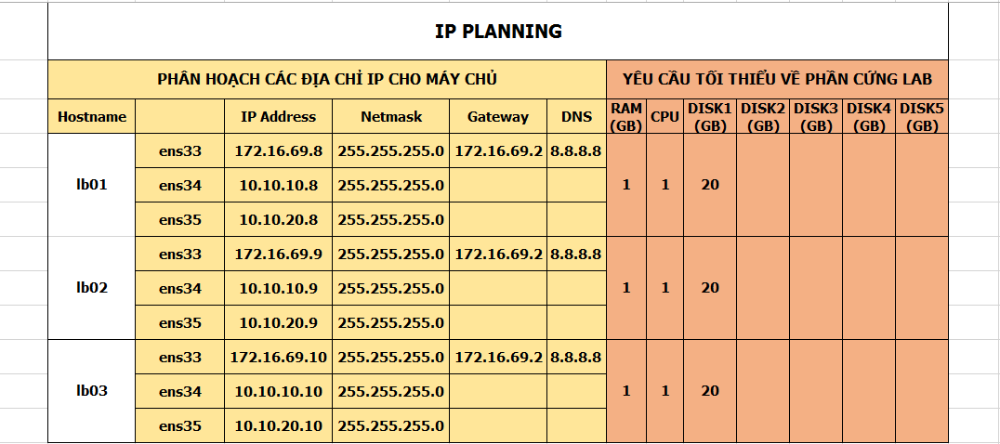

- ### <a name="">2. Cài đặt pacemaker và corosync</a>

	- Để cài đặt pacemaker, thực hiện chạy câu lệnh

			yum install pcs pacemaker fence-agents -y
			systemctl start pcsd
			systemctl enable pcsd

	- Tiếp theo ta cần cài đặt NGINX để cung cập một dịch vụ web. Để tiến hành cài đặt, chạy các câu lệnh sau:

			cat << EOF > /etc/yum.repos.d/nginx.repo
			[nginx]
			name=nginx repo
			baseurl=http://nginx.org/packages/mainline/centos/7/x86_64/
			gpgcheck=0
			enabled=1
			EOF
			
			yum install nginx -y
			systemctl start nginx
			systemctl enable nginx

	- Để đơn giản trong việc cấu hình, ta thực hiện tắt chính sách SELinux và tắt luôn cả dịch vụ firewall đi bằng việc sử dụng câu lệnh:

			systemctl stop firewalld
			systemctl disable firewalld
			sed -i 's/SELINUX=enforcing/SELINUX=disabled/g' /etc/sysconfig/selinux
			sed -i 's/SELINUX=enforcing/SELINUX=disabled/g' /etc/selinux/config
			setenforce 0

- ### <a name="">3. Quản lý cluster và các resource với Web GUI</a>

	- Trước khi muốn thực hiện tạo cluster và quản lý các node trong nó dễ dàng, ta nên đổi lại mật khẩu của user: `hacluster` với mật khẩu giống nhau ở tất cả các node cho thuận tiện. Sử dụng câu lệnh:

			echo your_password | passwd --stdin hacluster

		trong đó: your_password là mật khẩu mà bạn muốn đổi cho hacluster

	- Để chắc chắn ta có thể sử dụng giao diện web để quản lý cluster, ta chạy câu lệnh kiểm tra dịch vụ:

			systemctl status pcsd

		nếu kết quả có trùng với phần đóng khung màu đỏ trong hình sau thì chắc chắn ta có thể quản lý nó bằng giao diện web:

		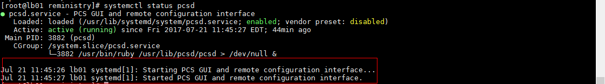

	- Sau khi, cài đặt  pacemaker thành công trên các node bạn có, bạn có sử dụng giao diện website cung cấp để quản lý cluster bằng việc truy cập tới địa chỉ:

			https://your_ip's_node:2224

		trong đó: your_ip's_node là địa chỉ IP của bất kỳ máy nào bạn đã thực hiện cài đặt pacemaker thành công trên nó.

	- Giao diện bắt đầu của trang website trông giống như sau:

		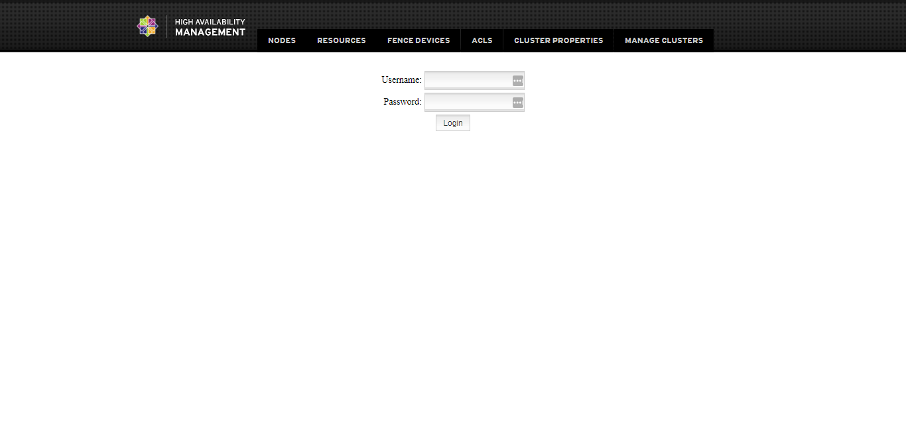

		thực hiện nhập: `username` là `hacluster` và `password`: là mật khẩu bạn đã thay đổi trước đó!

	- Giao diện sau khi đăng nhập thành công giống như sau:

		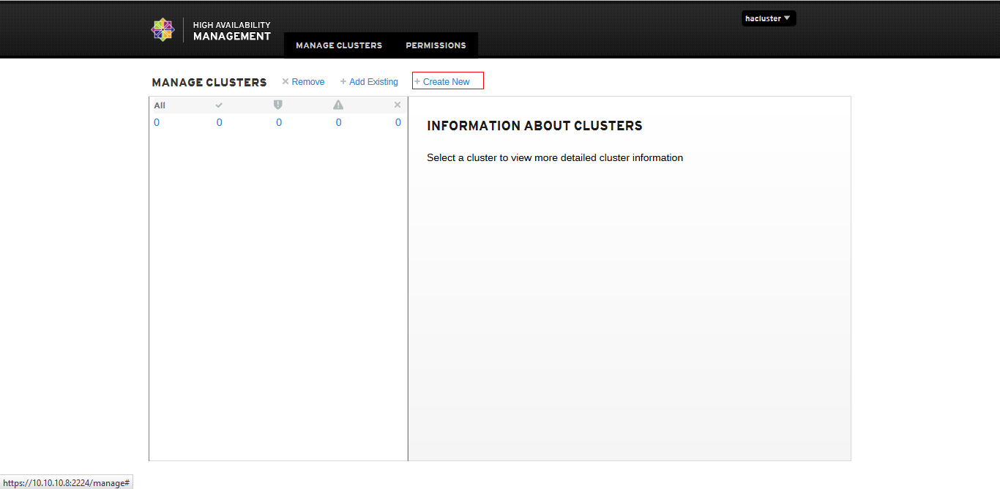

		nhấn vào `Create New` để tạo mới 1 cụm cluster

	- Kết quả hiện lên, sau đó bạn cần nhập vào đó tên của cluster và địa chỉ ip của các node mà bạn muốn thêm nó vào cluster. Sau đó rồi chọn `Create Cluster`. Ví dụ:

		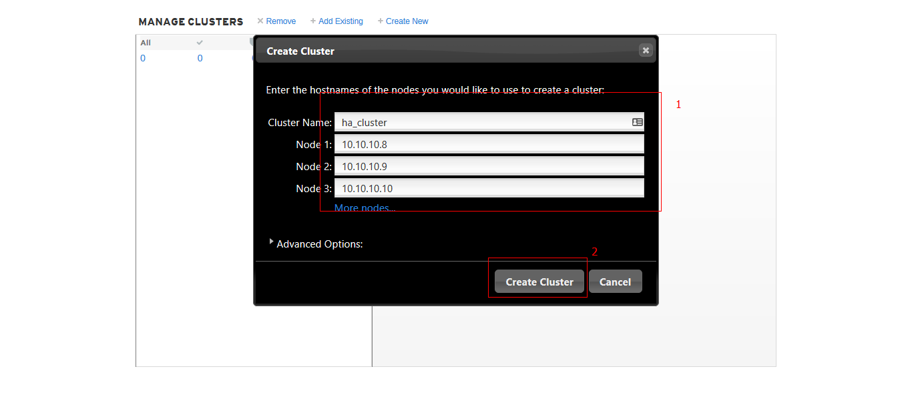

	- Một cửa sổ hiện lên yêu cầu bạn nhập mật khẩu để xác nhận thêm các node đó vào, bạn hãy nhập mật khẩu của user `hacluster` vào. Rồi chọn `Authenticate`.

		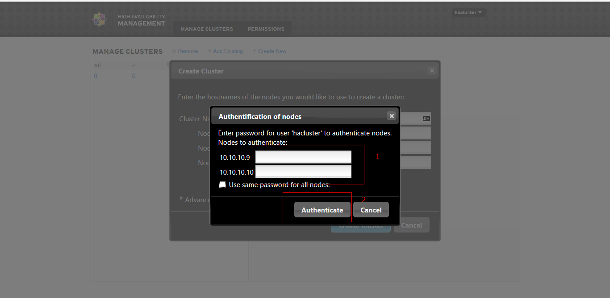

	- Kết quả nhận được như sau:

		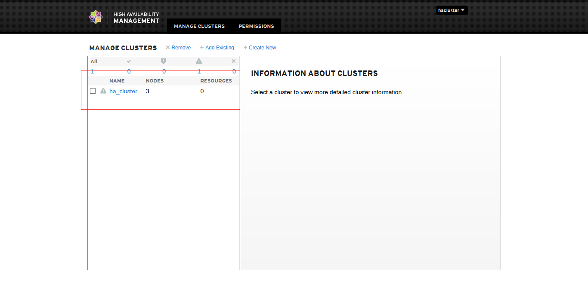

		sau khi nhận được kết quả, giao diện web sẽ tự động logout ra để đồng bộ dữ liệu, bạn cần thực hiện đăng nhập lại để tiếp tục quản lý.

	- Một điều khá bất ngờ lúc này sẽ xảy ra, đó là trong cluster sẽ báo có tới 6 node hiện đang nằm trong cluster. Có chuyện gì mà kì vậy? Bạn sẽ có được lời giải đáp trong các phần sau:

		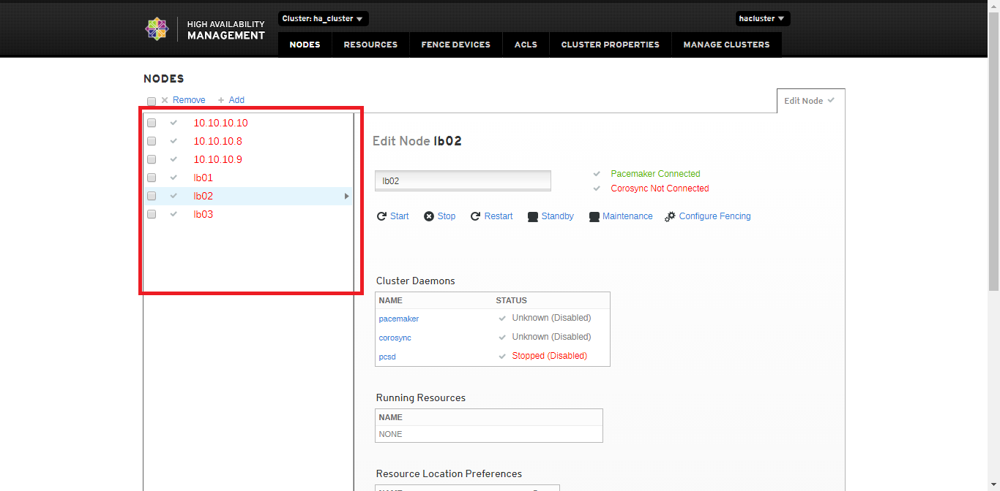

		tạm thời thì ta vẫn bỏ qua vấn đề này ở đây và sẽ giải quyết nó sau khi tạo các resource

	- Chọn vào `RESOURCES` như trong phần đóng khung màu đó giống hình sau để tạo ra các resource.

		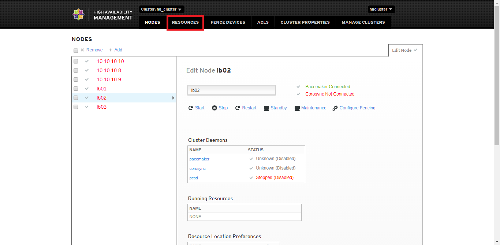

		sau đó chọn `Add` để thêm một resource.

	- Kết quả, một cửa sổ hiện lên, bạn hãy chọn và điền các giá trị giống như hình sau để tạo ra một resource có tên là Virtual_IP:

		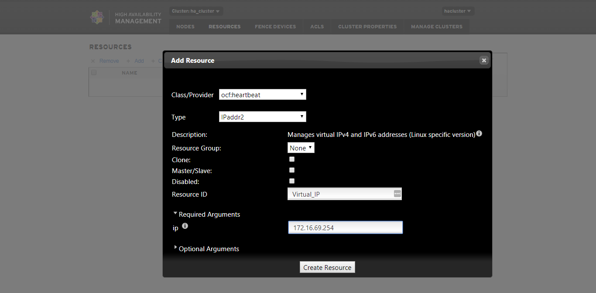

		chọn vào `Optional Arguments`, và điền tiếp các giá trị giống như hình sau:

		

	- Chọn `Create Resource` ta được kết quả giống như sau:

		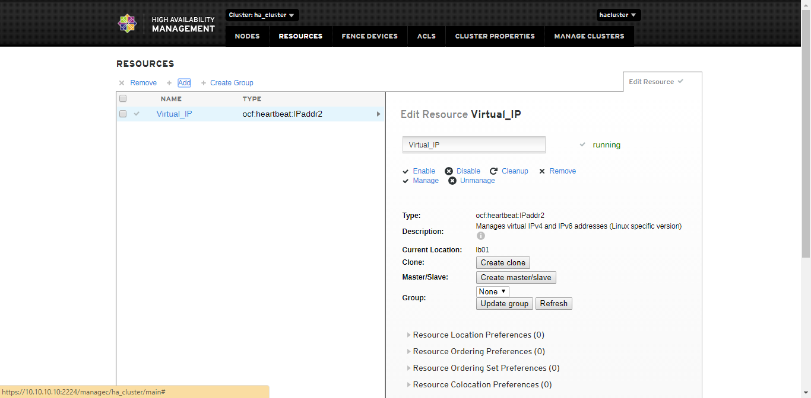

		vậy là đã tạo thành công một resource Virtual IP
	
	- Tiếp theo, ta tạo ra một resource `Web_Cluster`, các bước làm giống như trên. Với giá trị tại các mục giống như hình sau:

		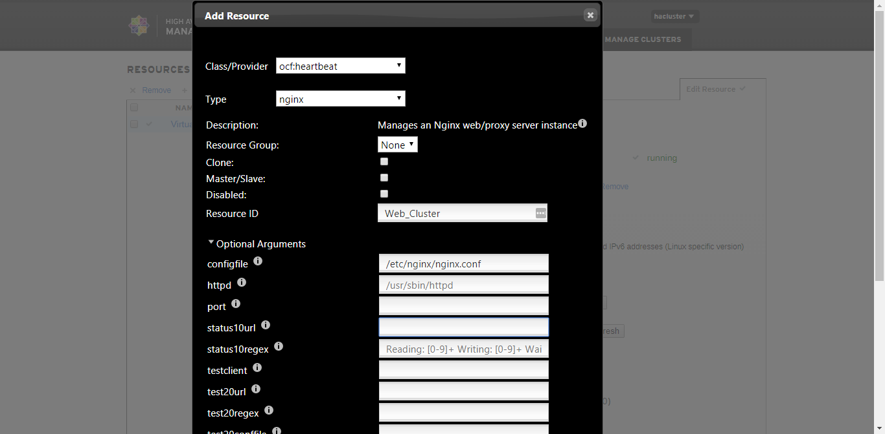

		kết quả có thể nhận được như sau:

		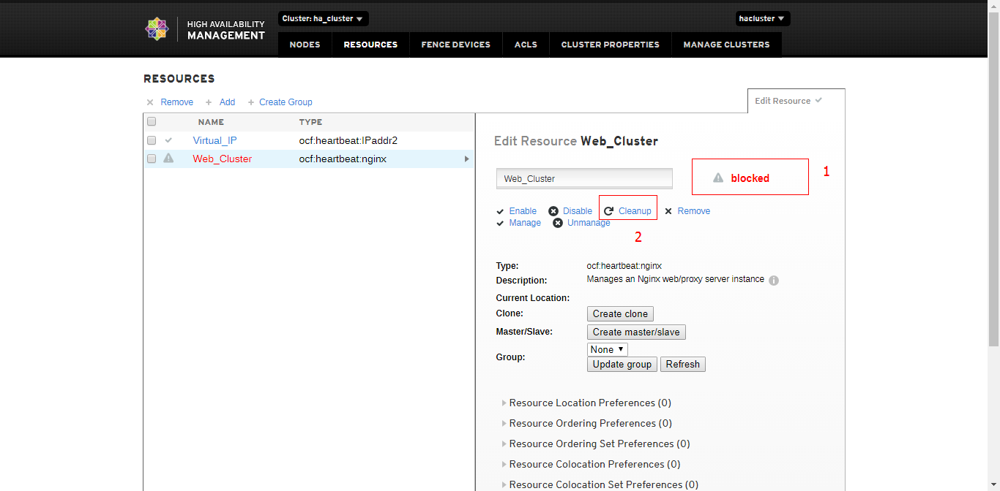

		bạn đừng lo lắng, hãy chọn `Clear` để xóa bỏ đi cảnh báo đó. Kết quả giống như hình dưới đây cũng có thể sẽ được ngay từ lần tạo đầu tiên.

		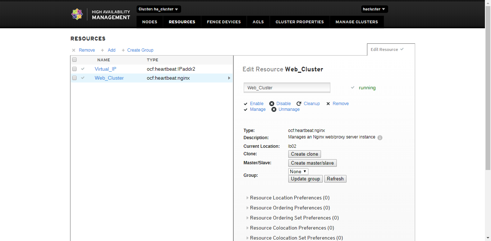

	- Tiếp theo, để đảm bảo cho các resource này hoạt động một cách ổn định nhất, ta cần tạo các ràng buộc cho các resource. Nói cách khác chính là tạo ra luật bắt chúng phải tuân theo. Nhấn vào resource `Virtual_IP`. để ý đến phần đóng khung màu đỏ như hình dưới đây:

		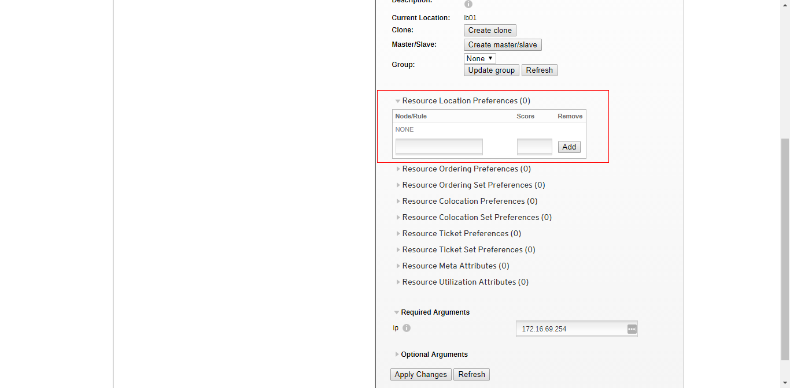

		đây là vùng tạo ra những luật mà chỉ cho phép các resource được chạy trên một node nào đó. Ví dụ:

		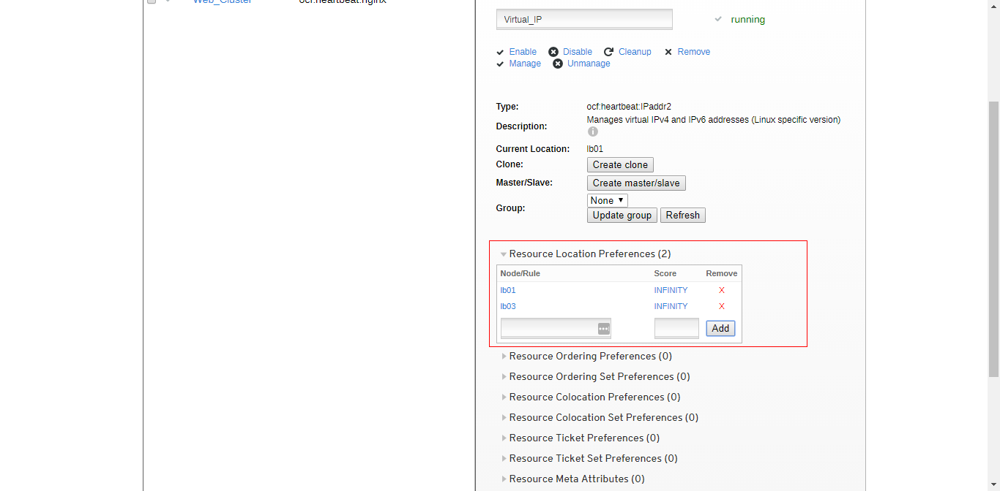

		cấu hình trên cho phép resource có thể chạy trên các node `lb01`, `lb03`. Mặc dù theo mặc định, thì nó có thể chạy trên tất cả các node. Xem thêm ý nghĩa của luật này tại [Các ràng buộc của resource trong cluster](constraint-pacemaker.md#location-constraints)

	- Sau đó, cấu hình cho hai resource đã tạo phải chạy cùng trên một node vì. `Virtual_IP` là một resource cung cấp một địa chỉ IP ảo cho phép bạn truy cập tới tất cả các dịch vụ khác qua nó, mà Web thì rõ ràng là phải cần có địa chỉ để truy cập trong khi các resource lại không hoạt động cố định trên một node nào đó khi bạn chưa tạo ra các ràng buộc cho điều này. Để thực hiện điều này, bạn hãy lựa chọn và điền các giá trị giống như trong phần đóng khung màu đỏ của hình sau:

		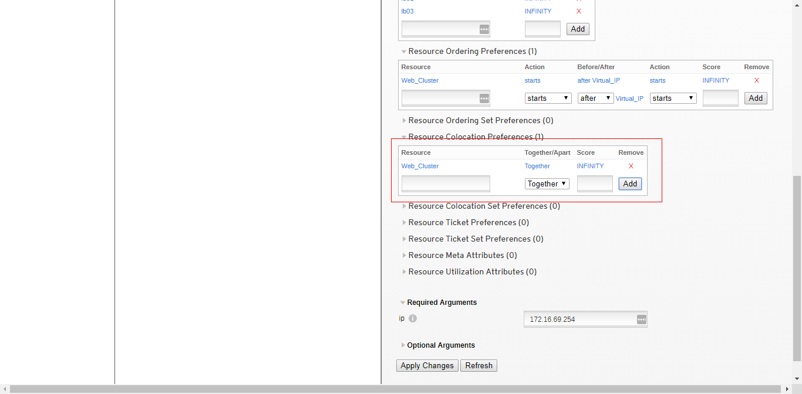

	- Thứ hai, resource Web chỉ thực sử được sử dụng và đi hoạt động một cách có ý nghĩa khi chúng ta biết được địa chỉ của nó. vậy điều gì sẽ xảy ra khi mà không có địa chỉ IP. Ta cần phải đảm bảo một điều rằng, có địa chỉ IP mới có dịch vụ Web. Suy ra, ta cần phải tạo một luật bắt `Virtual_IP` khởi động trước `Web_Cluster`. Thực hiện giống trong phần đóng khung màu đỏ của hình sau:

		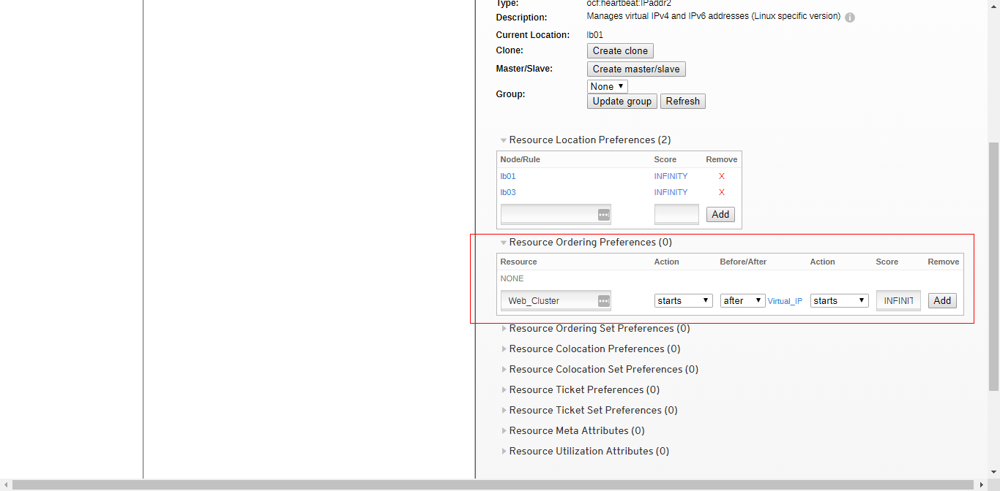

	- Tại thời điểm này, bạn có thể truy cập tới dịch vụ web server mà cluster cung cấp qua địa chỉ IP ảo (VIP).

		

		Đến đây coi như đã hoàn tất công việc. Tiếp theo ta sẽ xử lý các chuyện xuất hiện 6 node nhưng thực tế lại có 3 node trong cluster mà đã gặp ngay từ đầu.

	- 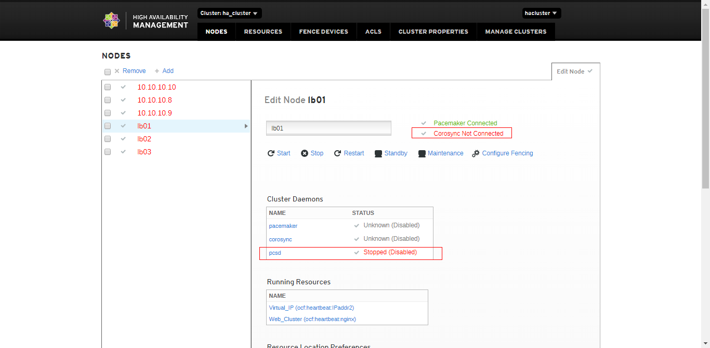

		Nỗi này xuất hiện, do việc ta sử dụng địa chỉ ip của các node để tạo ra một cluster mới. Kiểm tra qua cửa sổ dòng lệnh, ta chỉ có thấy thông báo có 3 node. Nhưng lại xuất hiện một cảnh bảo:

				WARNING: corosync and pacemaker node names do not match (IPs used in setup?)

		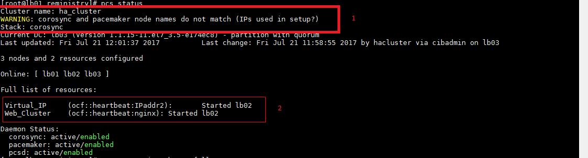

		trong hình trên:

		- phần đóng khung màu đỏ (1): chính là cảnh báo lỗi xuất hiện
		- phần đóng khung màu đỏ (2): cho biết các resource đang chạy ổn định và cùng trên một node khi ta tạo ra các luật (ràng buộc)

	- Bây giờ, chúng ta hãy giải quyết nó bằng các thao tác qua CLI:

		+ Bước 1: Thực hiện trỏ hostname qua sử dụng địa chỉ IP trong qua việc sửa file `/etc/hosts`. Ví dụ:

				cat << EOF > /etc/hosts
				10.10.10.8    lb01
				10.10.10.9    lb02
				10.10.10.10   lb03
				EOF

		+ Bước 2: Sửa đổi lại hostname trong file cấu hình corosync: `/etc/corosync/corosync.conf` với nội dung giống như hình sau:

			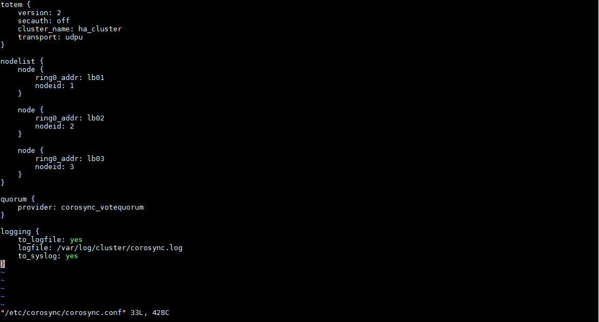

			sau đó lưu file lại.

		+ Bước 3: Thực hiện đồng bộ file cấu hình `corosync.conf` cho tất cả các node trong cluster. Sử dụng câu lệnh:

				pcs cluster sync

	- Ok. Vậy là đã xong rồi! Kết quả kiểm tra qua CLI trong giống như sau:

		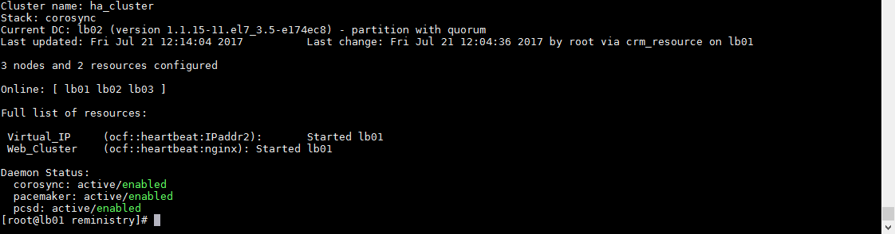

		quay lại giao diện web, thực hiện refesh ta thấy được kết quả:

		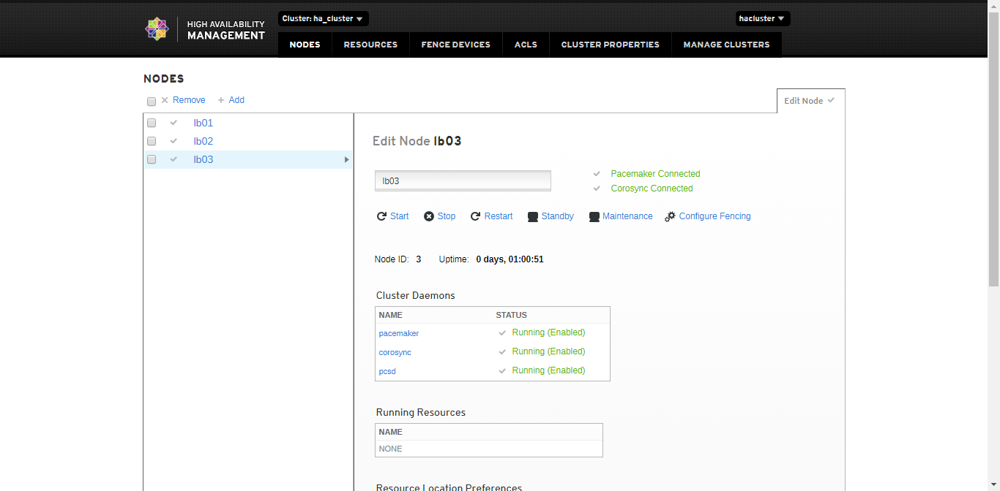

	- Phía trên là cách tạo và quản lý đơn giản cho cluster. Chúc bạn thành công ^_^

____	

# <a name="contents-other">Các nội dung khác</a>

	Sẽ cập nhật sau