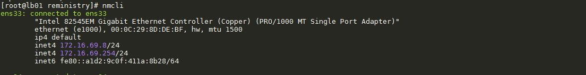
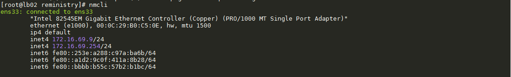
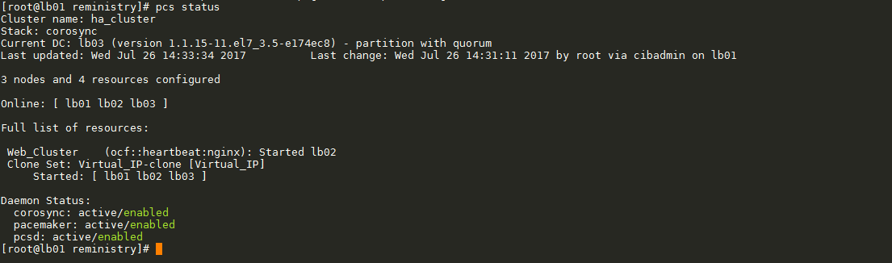
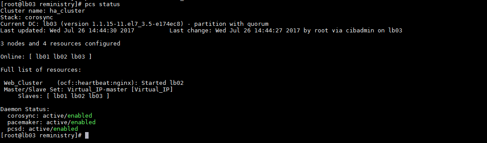
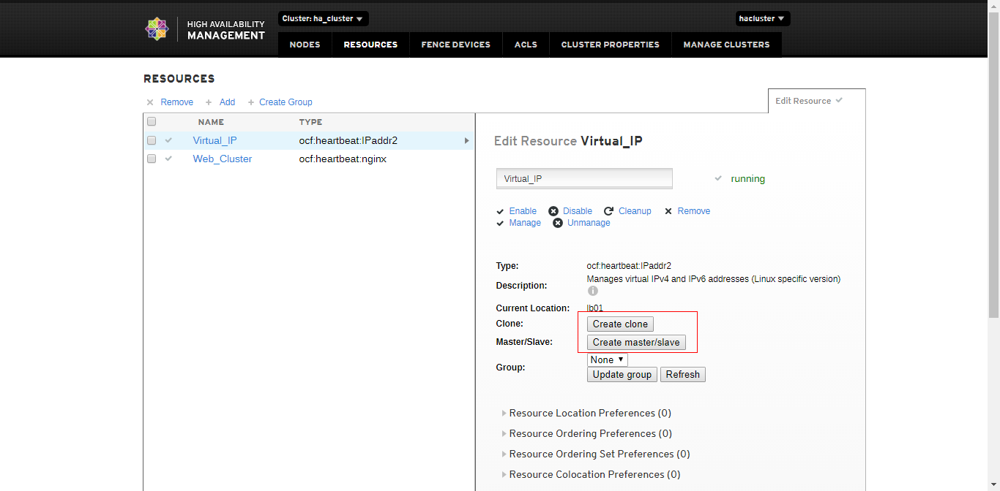
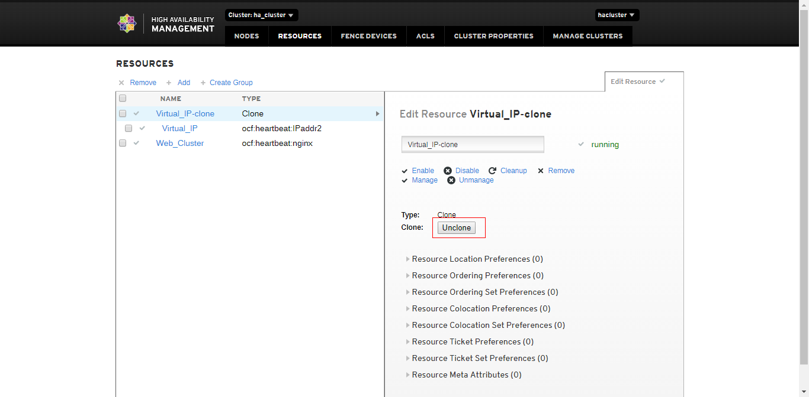
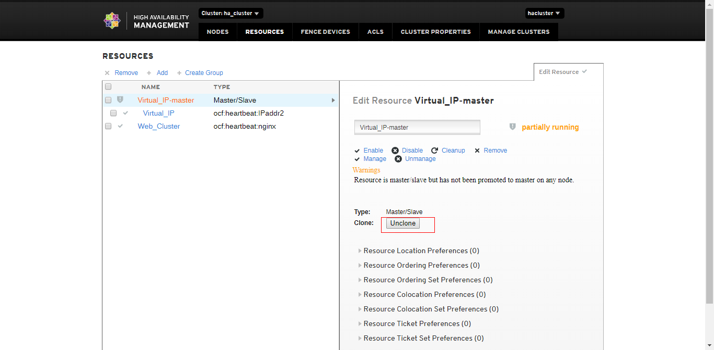
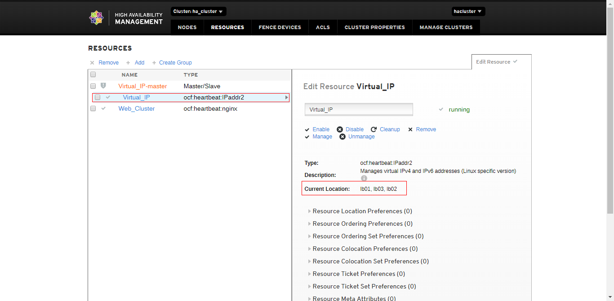

# E. Thực hiện cấu hình tạo cluster với chế độ active/active

____

# Mục lục

- [E.1 Cài đặt pacemaker và tạo nginx.](#install)
- [E.2 Cấu hình resource](#configure)
	- [E.2.1 Sử dụng câu lệnh](#cmd)
	- [E.2.2 Sử dụng giao diện website](#gui)
	- [E.2.3 Khởi động lại dịch vụ trong cluster](#star)
- [Các nội dung khác](#contents-other)
____

# Nội dung

- ### <a name="install">E.1 Cài đặt pacemaker và tạo nginx.</a>

	- Trước tiên, ta cần cài đặt pacemaker và tiến hành tạo cluster và các resource để quản lý theo hướng dẫn tại bài [1. Tổng quan về cài đặt cơ bản cho pacemaker - corosync](pcmk-pacemaker-corosync-installing.md#envir)

- ### <a name="configure">E.2 Cấu hình resource</a>

	- Để tạo ra một resource với chế độ active/active. Ta cần xác định xem resource nào cần thực hiện như vậy? Với mô hình và 2 resource đã tạo ở phần E.1. Ta nhận thấy resource `Virtual_IP` là resource quan trọng nhất. Bởi nó quyết định cho việc client có thể truy cập tới dịch vụ website hay không? Nếu như resource `Virtual_IP` không thực sự hoạt động, client sẽ không biết đâu là địa chỉ để truy cập tới dịch vụ website. Để đảm bảo resource `Web_Cluster` và resource `Virtual_IP` luôn hoạt động cùng nhau, ta có thế thêm các ràng buộc bắt 2 resource:

		1. Cùng hoạt động tại một node nào đó trong cluster (ràng buộc về vị trí hoặc đưa vào ràng buộc nhóm)
		2. Resource `Virtual_IP` phải hoạt động thành công trên một node nào đó thì mới cấp phép hoạt động cho resource `Web_Cluster` (ràng buộc về thứ tự). Xem thêm tại [5. Các ràng buộc resources trong pacemaker](pcmk-constraint.md)
	
	- Cả 2 hướng giải quyết trên chỉ thực sự có hiệu quả khi và chỉ khi cả 2 resource `Virtual_IP` và `Web_Cluster` đều có thể hoạt động một ổn định trên bất kỳ node nào có mặt trong cluster. Vậy điều gì sẽ xảy ra khi mà resource `Virtual_IP` đang hoạt động trên node `lb01` và theo cấu hình ràng buộc cho resource trong cluster đối với `Web_Cluster` thì `Web_Cluster` cũng phải hoạt động trên node `lb01` nhưng vì một lí do oái ăm nào đó mà `Web_Cluster` lại không thể hoạt động được trên node `lb01`? Có khá là nhiều hướng giải quyết lúc này, chẳng hạn:

		1. Tạo lại ràng buộc thứ tự cho phép `Web_Cluster` khởi động trước `Virtual_IP`
		2. Dịch chuyển `Virtual_IP` sang node khác và khởi động lại resource `Virtual_IP`. 
	
	cả hai hướng giải quyết đều chưa thực sự đảm bảo bởi muốn client có thể sử dụng các dịch vụ mà cluster cung cấp thì `Virtual_IP` có lẽ là nhân tố quyết định tất cả. Nó chính là `cửa ngõ` cho phép client truy cập tới cluster trong khi `Virtual_IP` không được đảm bảo chắc chắn sẽ được khởi động trước các resource khác.

	- Vậy hướng giải quyết khả thi nhất ở đây là gì?
	Trong pacemaker có cung cấp cho ta một cơ chế cho phép ta thực hiên promte một resource thành resource master. Với cơ chế này, một resource được chỉ định là master sẽ được clone lên tất cả các node trong cluster và hoạt động trên đó. Vậy nên, khi `Web_Cluster` có thể không chạy ở trên một node nào trong đó trong cluster dẫn đến việc hoạt động của cluster không được đảm bảo, ta có thể sử dụng hướng giải quyết này để đảm bảo tối đa chức năng cho cluster. Chi tiết hướng giải quyết này như sau:

- ### <a name="cmd">E.2.1 Sử dụng câu lệnh</a>

	- Để đưa resource `Virtual_IP` thành resource master. Ta sử dụng câu lệnh:

			pcs resource master Virtual_IP

		hoặc 

			pcs resource clone Virtual_IP

	- Khi resource `Virtual_IP` hoạt động trên node nào thì interface network node đó sẽ có chứa 2 địa chỉ IP. Một địa chỉ IP là địa chỉ thật, một địa chỉ IP là địa chỉ `giả` mà ta cấu hình cho resource `Virtual_IP`. Vậy lên ta có thể kiểm tra bằng việc sử dụng câu lệnh:

			nmcli

		kết quả xem được như sau:

		1. Trên node lb01:

			

		2. Trên node lb02:

			
		
		3. Trên node lb03:

			

		hoặc kiểm tra bằng câu lệnh `pcs status` kết quả hiển thị như sau:

		1. Nếu sử dụng clone resource:

			

		2. Nếu sử dụng cấu hình resource master:

			

	- Để hủy bỏ resource `Virtual_IP` thành resource master. Ta sử dụng câu lệnh:

			pcs resource unclone Virtual_IP

- ### <a name="gui">E.2.2 Sử dụng giao diện website</a>

	- Bước 1: Truy cập vào trang quản lý cluster. Tại mục `Resource`. Chọn vào resource `Virtual_IP`, ta thấy:

		

	- Bước 2: Muốn thực hiện clone, ta chọn vào `Clone`. Kết quả như sau:

		

		hoặc muốn thực hiện chuyển thành master resource. Ta chọn vào `Master/Slave`. Kết quả:
	
		

	- Bước 3: Kiểm tra kết quả bằng việc chọn vào resource. Chú ý phần đóng khung màu đỏ:

		

	kết quả này giống nhau trong cả 2 trường hợp bạn thực hiện cấu hình cho resource.

- <a name="star">E.2.3 Khởi động lại dịch vụ trong cluster</a>

	- Trong khi đưa một dịch vụ từ hệ thống vào pacemaker để quản lý. Vì một lý do nào đó bạn muốn khởi động lại dịch vụ thì bạn không thể sử dụng phương án theo cách thông thường mà phải khởi động lại resource quản lý dịch vụ đó. Ví dụ, để khởi động lại dịch vụ web trong cluster, bạn sẽ phải chạy câu lệnh như sau:

			pcs resource restart Web_Cluster

		thay vì:

			systemctl restart nginx

		hoặc:

			service nginx restart

		Chỉ có hành động khởi động lại dịch vụ là bắt buộc phải làm như này.
____

# <a name="contents-other">Các nội dung khác</a>

- [1. Cài đặt pacemaker](pcmk-pacemaker-corosync-installing.md)
	- [1.1 Môi trường cài đặt](pcmk-pacemaker-corosync-installing.md#envir)
	- [1.2 Mô hình hệ thống](pcmk-pacemaker-corosync-installing.md#block)
	- [1.3 IP Plan](pcmk-pacemaker-corosync-installing.md#ipPlan)
	- [1.4 Cài đặt nginx và modules](pcmk-pacemaker-corosync-installing.md#nginx)
	- [1.5 Kiểm tra cài đặt nginx](pcmk-pacemaker-corosync-installing.md#test)
	- [1.6 Cài đặt pacemaker và corosync để tạo cluster cho nginx](pcmk-pacemaker-corosync-installing.md#pacemaker)
	- [1.7 Cấu hình để thêm các resources vào Cluster](pcmk-pacemaker-corosync-installing.md#configCluster)
	- [1.8 Thêm resource NGINX để pacemaker quản lý.](pcmk-pacemaker-corosync-installing.md#addResources)
	- [1.9 Quản lý các resource với Web-GUI](pcmk-pacemaker-corosync-installing.md#webgui)
