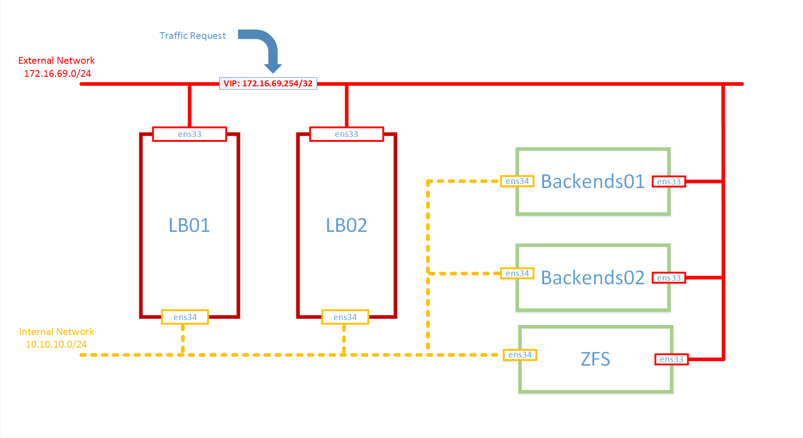
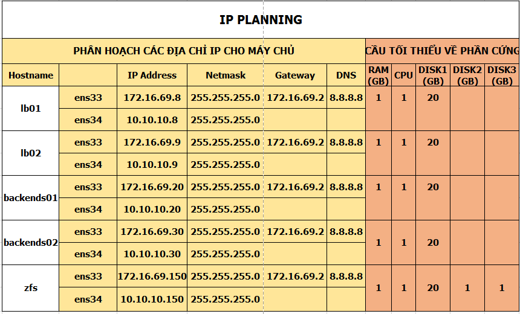

# 2. Tích hợp ZFS với Pacemaker và Corosync

____

# Mục lục


- [1. ZFS là gì?](#what-is)
- [2. Storage pools](s-pools)
- [3. Toàn vẹn dữ liệu](#di)
- [4. Snapshot](#ss)
- [5. Tích hợp ZFS với Pacemaker và Corosync](#integrate)
- [6. Kiểm tra kết quả](#checksummed)
- [Các nội dung khác](#content-others)

____

# <a name="content">Nội dung</a>

- ### <a name="what-is">1. ZFS là gì?</a>

    - ZFS (Zettabyte File System) là sự kết hợp giữa Volume Manager và Filesystem hoạt động cơ bản bằng việc thay đổi cách mà file systems quản lý với nhiều tính năng và lợi ích mà không thế tìm thấy trong bất kỳ hệ thống hiện có ngày nay. ZFS hoạt động một cách mạnh mẽ và dễ dàng để quản lý.

    - Nó cung cấp không gian lưu trữ rộng hơn cho các tập tin, tăng cường quản lý và cải thiện đáng kể cho việc lưu trữ dữ liệu toàn vẹn.

    - ZFS sử dụng lược đồ định địa chỉ 128-bit và có thể lưu trữ tới 275 tỷ TB mỗi vùng lưu trữ. Giới hạn công suất của ZFS rất xa so với khả năng không thể tưởng tượng được.


- ### <a name="s-pools">2. Storage pools</a>

    - ZFS không có khái niệm về dung lượng đĩa, phân vùng cung cấp đĩa bằng cách sử dụng lưu trữ chung, trong đó tất cả các ổ đĩa cứng có sẵn trong một hệ thống đều được kết hợp với nhau. Băng thông kết hợp của các thiết bị gộp lại có sẵn cho ZFS, có hiệu quả tối đa hóa không gian lưu trữ, tốc độ và tính khả dụng.

    - ZFS có sẵn ổ đĩa lưu trữ và tập hợp chúng lại với nhau như một ổ đĩa duy nhất, được gọi là "zpool". Điều này có thể được tối ưu hóa về dung lượng, hiệu năng I / O hoặc sự dư thừa, sử dụng striping, mirroring hoặc một số dạng RAID. Nếu cần thêm dung lượng lưu trữ, thì có thể thêm nhiều ổ đĩa vào zpool. ZFS nhìn thấy ổ đĩa mới và bắt đầu sử dụng nó một cách tự động, cân bằng I / O và tối đa hóa thông lượng.

    - Hệ thống tập tin không còn bị ràng buộc với các thiết bị riêng lẻ, cho phép chia sẻ không gian đĩa với tất cả các hệ thống tập tin trong zpool. Bạn không cần phải xác định trước kích thước của một hệ thống tập tin, như các hệ thống tập tin phát triển tự động trong không gian đĩa được phân bổ cho các pool lưu trữ. Khi mới lưu trữ được thêm vào, tất cả các hệ thống tập tin trong pool có thể ngay lập tức sử dụng không gian đĩa bổ sung mà không cần làm việc thêm.


- ### <a name="di">3. Toàn vẹn dữ liệu</a>

    - Một tính năng chính khác biệt ZFS từ các hệ thống tập tin khác là ZFS được thiết kế với sự tập trung vào tính toàn vẹn dữ liệu. Đó là, nó được thiết kế để bảo vệ dữ liệu trên đĩa chống lại các lỗi liên quan đến dữ liệu, lỗi trong phần mềm của đĩa, phantom writes, đọc sai / ghi sai, các lỗi bộ nhớ giữa mảng và bộ nhớ máy chủ, vô tình ghi đè.

    - ZFS đảm bảo rằng dữ liệu luôn luôn nhất quán trên đĩa bằng cách sử dụng một số kỹ thuật, bao gồm bản sao chép. Điều này có nghĩa là khi dữ liệu được thay đổi, nó không bị ghi đè - nó luôn được ghi vào một khối mới và được kiểm tra trước khi các con trỏ tới dữ liệu được thay đổi. Dữ liệu cũ có thể được giữ lại, tạo ảnh chụp nhanh dữ liệu (snapshot data) qua thời gian khi có thay đổi.


- ### <a name="ss">4. Snapshot</a>

    - Một lợi thế của copy-on-write là, khi ZFS viết dữ liệu mới, các khối chứa dữ liệu cũ có thể được giữ lại, cho phép duy trì một phiên bản snapshot của hệ thống tập tin. Ảnh chụp nhanh ZFS được tạo ra rất nhanh chóng, vì tất cả dữ liệu tạo ảnh chụp nhanh đã được lưu trữ.

    - Ngoài ra, ZFS còn có một số tính năng hữu ích khác, có thể xem [tại đây](http://www.zeta.systems/zetavault/what-is-zfs/)


- ### <a name="integrate">5. Tích hợp ZFS với Pacemaker và Corosync</a>

    - Đầu tiên, ta cần tạo ra một cluster sử dụng Pacemaker và Corosync. Mô hình của toàn bộ hệ thống thực hiện lab giống như sau:

        


        với địa chỉ IP cho các máy được sử dụng như sau:

        


    - Trên 2 node `lb01` và `lb02`, ta thực hiện cài đặt Pacemaker và Corosync để có thể tạo ra được 1 cluster từ 2 node này:
    
            yum install -y pcs pcsd 

        khi cài đặt xong, ta cần khởi động các dịch vụ `pacemaker` và `corosync`:

            systemctl start pcsd
            systemctl start corosync

        cho phép `pacemaker` và `corosync` khởi động cùng với hệ thống:

            systemctl enable pcsd
            systemctl enable corosync
    
    + Thực hiện cấu hình trỏ host và proxy cho os để tăng tốc độ cài đặt

            echo "127.0.0.1        localhost" > /etc/hosts
            echo "10.10.10.8       lb01" >> /etc/hosts
            echo "10.10.10.9       lb02" >> /etc/hosts
            echo "10.10.10.20      be01" >> /etc/hosts
            echo "10.10.10.30      be02" >> /etc/hosts
            echo "10.10.10.150      zfs" >> /etc/hosts

    - Ta cần phải tắt firewalld trên cả 2 node `lb01` và `lb02`:

            sudo systemctl disable firewalld
            sudo systemctl stop firewalld

            sed -i 's/SElinux=enforcing/SElinux=disabled/g' /etc/sysconfig/SElinux
            sed -i 's/SElinux=enforcing/SElinux=disabled/g' /etc/SElinux/config

            init 6

    - Kiểm tra lại trạng thái của `pacemaker` bằng lệnh `systemctl status pcsd`, kết quả như sau:

            Loaded: loaded (/usr/lib/systemd/system/pcsd.service; enabled; vendor preset: disabled)
            Active: active (running) since Sun 2017-06-04 23:10:52 EDT; 1h 7min ago
             Main PID: 613 (pcsd)
                CGroup: /system.slice/pcsd.service
                       └─613 /usr/bin/ruby /usr/lib/pcsd/pcsd > /dev/null &

            Jun 04 23:10:47 lb01 systemd[1]: Starting PCS GUI and remote configuration interface...
            Jun 04 23:10:52 lb01 systemd[1]: Started PCS GUI and remote configuration interface.

    + Thiết lập mật khẩu cho người dùng `hacluster`:

            passwd hacluster

        Lưu ý: đặt mật khẩu giống nhau trên cả 3 node.

    + Đăng nhập vào trang quản lý pacemaker (Web GUI) qua địa chỉ ip của node. Ví dụ ở đây là https://172.172.16.69.8:2224

    + Tạo cluster (Chỉ thực thiện trên cấu hình trên một node duy nhất)

        - Tạo xác thực giữa các node với nhau bằng câu lệnh:

                pcs cluster auth lb01 lb02

            sau đó nhập password của người dùng `hacluster` đã tạo ở phía trên. Kết quả nhận được như sau:

                #pcs cluster auth lb01 lb02
                 Username: hacluster
                 Password:
                 lb01: Authorized
                 lb02: Authorized

        - Cấu hình cho cluster

                pcs cluster setup --name ha_cluster lb01 lb02

            trong câu lệnh trên:

                - ha_cluster là tên của cluster mà bạn sẽ tạo, mục này có thể nhập tùy ý.
                - lb01 lb02 là hostname các máy chủ trong cụm cluster.
                  Muốn sử dụng tên này thì bạn phải chắc chắn đã khai báo trong file /etc/hosts

            kết quả nhân được như sau:

                Destroying cluster on nodes: lb01, lb02...
                lb01: Stopping Cluster (pacemaker)...
                lb02: Stopping Cluster (pacemaker)...
                lb01: Successfully destroyed cluster
                lb02: Successfully destroyed cluster

                Sending cluster config files to the nodes...
                lb01: Succeeded
                lb02: Succeeded

                Synchronizing pcsd certificates on nodes lb01, lb02...
                lb01: Success
                lb02: Success

                Restarting pcsd on the nodes in order to reload the certificates...
                lb01: Success
                lb02: Success

        - Khởi động lại cluster vừa tạo:

                pcs cluster start --all 

            kết quả nhân được như sau:

                lb02: Starting Cluster...
                lb01: Starting Cluster...

        - Kích hoạt cho phép cluster khởi động cùng với OS:

                pcs cluster enable --all 

            kết quả như sau:

                lb01: Cluster Enabled
                lb02: Cluster Enabled

        - Kiểm tra trạng thái của corosync

                pcs status corosync

            kết quả:

                Membership information
                ----------------------
                    Nodeid      Votes Name
                         1          1 lb01 (local)
                         2          1 lb02


    - #### Cấu hình để thêm các resources vào Cluster

        - Disable cơ chế `STONITH`
            ```sh
            pcs property set stonith-enabled=false
            ```

        - Thiết lập policy cho cơ chế `quorum` (bỏ qua bước này nếu như cluster có nhiều hơn 2 node)
            ```sh
            pcs property set no-quorum-policy=ignore
            ```

        - Disable auto failback
            ```sh
            pcs property set default-resource-stickiness="INFINITY"
            ```

        - Kiểm tra lại các thiết lập ở trên
            ```sh
            pcs property list 
            ```
        - Kết quả như bên dưới
            ```sh
            Cluster Properties:
            cluster-infrastructure: corosync
            cluster-name: ha_cluster
            dc-version: 1.1.15-11.el7_3.4-e174ec8
            default-resource-stickiness: INFINITY
            have-watchdog: false
            no-quorum-policy: ignore
            stonith-enabled: false
            ```
        
        - Trong phần tiếp theo, ta sẽ tạo ra một resoure Virtual_IP có địa chỉ IP là 172.16.69.254 để cho các client có thể gửi các request tới địa chỉ IP này.

                pcs resource create Virtual_IP ocf:heartbeat:IPaddr2 \
                ip=172.16.69.254 cidr_netmask=24 \
                op monitor interval=30s

    - Tiếp theo, ta cần thực hiện cài đặt `zfs` trên node `zfs`, thực hiện chạy câu lệnh sau:

            yum install -y http://download.zfsonlinux.org/epel/zfs-release.el7_3.noarch.rpm
            gpg --quiet --with-fingerprint /etc/pki/rpm-gpg/RPM-GPG-KEY-zfsonlinux

        sau đó, ta cần sửa lại nội dung file /etc/yum.repo/zfs.repo tương tự như sau để khi cài đặt zfs, hệ thống sẽ cài thêm gói `zfs-kmod` thay vì cài gói `zfs-dkms` như mặc định để đề phòng cho trường hợp bạn gặp phải lỗi `modprobe: FATAL: Module zfs not found.` ở bước phía dưới:

            # /etc/yum.repos.d/zfs.repo

            [zfs]
            name=ZFS on Linux for EL 7 - dkms
            baseurl=http://download.zfsonlinux.org/epel/7/$basearch/
            enabled=0
            metadata_expire=7d
            gpgcheck=1
            gpgkey=file:///etc/pki/rpm-gpg/RPM-GPG-KEY-zfsonlinux
            [zfs-kmod]
            name=ZFS on Linux for EL 7 - kmod
            baseurl=http://download.zfsonlinux.org/epel/7/kmod/$basearch/
            enabled=1
            metadata_expire=7
            gpgcheck=1
            gpgkey=file:///etc/pki/rpm-gpg/RPM-GPG-KEY-zfsonlinux

        cuối cùng ta chạy câu lệnh sau để cài đặt zfs và device-mapper-multipath software:

            yum install -y zfs device-mapper-multipath

    - Tạo ra một file cấu hình trống để cho de vice-mapper-multipath có thể khởi chạy:

            touch /etc/multipath.conf
            systemctl start multipathd
            systemctl enable multipath

    - Cho phép zfs tự động mount disk và khởi động cùng hệ thống:

            systemctl enable zfs-import-cache.service zfs-mount.service \
            zfs-share.service zfs-zed.service zfs.target

    - Việc cuối cùng dành cho bước cài đặt `zfs` này là, ta cần import module của zfs vào trong kernel bằng việc sử dụng câu lệnh:

            modprobe zfs

        sau đó ta cần tạo ra một storage pool trước khi thực hiện thêm mới một resource zfs cho pacemaker quản lý bằng cách xử dụng câu lệnh sau:

            zpool create -f vol1 /dev/sdb /dev/sdc

        trong đó:

            - vol1 là tên của storage pool
            - /dev/sdb và /dev/sdc là đường mount của 2 đĩa disk mà bạn muốn dùng nó
                                   để gộp lại thành một storage pool

        bạn có thể lấy thông tin về đường dẫn disk qua việc sử dụng câu lệnh:

            fdisk -l

        kết quả ta được tương tự như sau:

            Disk /dev/sda: 21.5 GB, 21474836480 bytes, 41943040 sectors
            Units = sectors of 1 * 512 = 512 bytes
            Sector size (logical/physical): 512 bytes / 512 bytes
            I/O size (minimum/optimal): 512 bytes / 512 bytes
            Disk label type: dos
            Disk identifier: 0x0000cc55

               Device Boot      Start         End      Blocks   Id  System
            /dev/sda1   *        2048     2099199     1048576   83  Linux
            /dev/sda2         2099200    41943039    19921920   8e  Linux LVM

            Disk /dev/sdb: 1073 MB, 1073741824 bytes, 2097152 sectors
            Units = sectors of 1 * 512 = 512 bytes
            Sector size (logical/physical): 512 bytes / 512 bytes
            I/O size (minimum/optimal): 512 bytes / 512 bytes


            Disk /dev/sdc: 1073 MB, 1073741824 bytes, 2097152 sectors
            Units = sectors of 1 * 512 = 512 bytes
            Sector size (logical/physical): 512 bytes / 512 bytes
            I/O size (minimum/optimal): 512 bytes / 512 bytes


            Disk /dev/mapper/cl-root: 18.2 GB, 18249416704 bytes, 35643392 sectors
            Units = sectors of 1 * 512 = 512 bytes
            Sector size (logical/physical): 512 bytes / 512 bytes
            I/O size (minimum/optimal): 512 bytes / 512 bytes


            Disk /dev/mapper/cl-swap: 2147 MB, 2147483648 bytes, 4194304 sectors
            Units = sectors of 1 * 512 = 512 bytes
            Sector size (logical/physical): 512 bytes / 512 bytes
            I/O size (minimum/optimal): 512 bytes / 512 bytes

        qua kết quả của câu lệnh trên thì ta thấy /dev/sdb và /dev/sdc chính là đường dẫn của 2 disk mà ta đang muốn gộp chúng lại.

    - Để kiểm tra kết quả của việc tạo ra storage pool đã thành công hay chưa, ta có thể sử dụng câu lệnh sau để kiểm tra:

            zpool status

        nếu đã tạo thành công, kết quả sẽ tương tự giống như sau:

              pool: vol1
             state: ONLINE
              scan: none requested
            config:

                    NAME        STATE     READ WRITE CKSUM
                    vol1        ONLINE       0     0     0
                      sdb       ONLINE       0     0     0
                      sdc       ONLINE       0     0     0

            errors: No known data errors

        tại thời điểm này, bạn hãy thử reboot lại node `zfs` sau đó chạy câu lệnh sau để kiểm tra kết quả:

            zfs list

        kết quả sẽ được trả về nếu ta đã cài đặt hoàn toàn thành công tương tự như sau:

            NAME   USED  AVAIL  REFER  MOUNTPOINT
            vol1  85.5K  1.84G    24K  /vol1

        nếu gặp lỗi sau:

            The ZFS modules are not loaded.
            Try running '/sbin/modprobe zfs' as root to load them.

        ta cần chạy câu lệnh sau đây để khắc phục vấn đề này (xem theo nội dung tại: [ZFS 0.6.5.8 modules not loading during boot (CentOS 7)](https://github.com/zfsonlinux/zfs/issues/5191)):

            systemctl preset zfs-import-cache zfs-import-scan zfs-mount zfs-share zfs-zed zfs.target


    - Download resource zfs cho pacemaker để có thể tạo ra một resource zfs cho pacemaker quản lý. Để download, ta thực hiện câu lệnh sau trên cả hai node `lb01` và `lb02`:

            cd /usr/lib/ocf/resource.d/heartbeat/
            wget https://github.com/skiselkov/stmf-ha/raw/master/heartbeat/ZFS
            chmod +x ZFS

        tiếp theo, để tạo ra resource cho dịch vụ zfs, ta sử dụng câu lệnh sau:

            pcs resource create vol1 ZFS pool="vol1" op start timeout="90" op stop timeout="90" --group=vol-zfs
        
        trong đó:

            - vol1: là tên của resource
            - ZFS: là loại resource
            - pool="vol1": khai báo storage pool cho resource quản lý đó là vol1
            

    - Tạo ràng buộc cho resource vol1 và resource Virtual_IP phải cùng chạy với nhau trên 1 node. Vì ta sử dụng zfs cho chức năng lưu trữ và chia sẻ file cho các node. Ta nhận thấy resource vol1 cần phải phụ thuộc vào resource Virtual_IP, nên ta cần phải chạy câu lệnh sau để tạo ra ràng buộc:

            pcs constraint colocation add vol1 with Virtual_IP

    - Để sử dụng các chức năng về chia sẻ cũng như đồng bộ dữ liệu giữa các node, zfs sử dụng việc chia sẻ các snapshot để đồng bộ giữa các node cài đặt zfs hoặc chia sẻ theo hướng client-server sử dụng dịch vụ nfs và rpcbind. Đầu tiên, ta cần khởi chạy 2 dịch vụ nfs và rpcbind để có thể sử dụng đầy đủ 2 hướng đồng bộ và chia sẻ dữ liệu trên qua việc chạy câu lệnh sau trên node `zfs`:

            systemctl enable rpcbind nfs
            systemctl start rpcbind nfs

        sau đó, ta cần thiết lập cho storage pool nào được phép chia sẻ dữ liệu qua nfs bằng việc sử dụng câu lệnh sau:

            zfs set sharenfs=rw=@10.10.10.0/24,sync,no_root_squash,no_wdelay vol1/management

        trong đó:
            
            - vol1: là thư mục được chia sẻ cho các node khác
            - 10.10.10.0/24: là dải mạng mà các máy chủ phải nằm trong đó mới có thể sử dụng 
                             (tùy chọn này không bắt buộc phải khai báo)
            - rw: là quyền được phép của các máy chủ khi sử dụng. Ở đây là Read và Write
            - Các tham số khác có thể xem thêm ở đây: 
              https://www.server-world.info/en/note?os=CentOS_7&p=nfs&f=1

        Hãy tạo một vài nội dung như: tạo một thư mục, một file vào trong thư mục /vol1 để thuận tiện cho bước kiểm tra kết quả ở phía dưới. Ví dụ:

            mkdir test
            mkdir sharednfs
            mkdir private
            touch nfs.conf

- ### <a name="checksummed">6. Kiểm tra kết quả</a>

    - Trên 2 node `backends01` và `backends02`, ta thực hiện cài đặt NFS theo hướng dẫn như sau trên cả 2 node như sau:

        Bước 1: Cài đặt nfs-utils:

            yum install -y nfs-utils

        khi cài đặt xong, ta có thể kiểm tra với câu lệnh:

            showmount -e 10.10.10.150

        để biết xem ta được node `zfs` chia sẻ cho sử dụng những thư mục nào trên node. Khi chạy, ta được kết quả hiển thị tương tự như sau:

            Export list for  10.10.10.150:
            /vol1   *      

        Bước 2: Cấu hình NFS client:

            vi /etc/idmapd.conf

        sau đó bỏ comment dòng thứ 5 và sửa thành:

            Domain = zfs
        
        Bước 3: Khởi động dịch vụ:

            systemctl start rpcbind 
            systemctl enable rpcbind 

        Bước 4: Thực hiện ánh xạ thư mục chia sẻ:

            mkdir /vol1
            mount -t nfs zfs:/vol1 /vol1

        Bước 5: Cấu hình NFS mounting khi system boots:

            vi /etc/fstab

        thêm dòng sau vào cuối file và lưu lại:

            zfs:/vol1  /vol1                   nfs     defaults        0 0

        Bước 6: Cấu hình auto-mouting khi khởi động hệ thống:

        Bước 6.1: Cài đặt autofs:

            yum -y install autofs

        Bước 6.2: Thực hiện cấu hình:

            vi /etc/auto.master

        thêm vào nội dung sau vào cuối file và lưu lại:

            /-    /etc/auto.mount

        tiếp theo, tạo file `/etc/auto.mount` với nội dung file

            echo "/vol1 -fstype=nfs,rw  zfs:/vol1" >> /etc/auto.mount

        Bước 6: Khởi động dịch vụ:

            systemctl start autofs 
            systemctl enable autofs 

        Bước 7 (bước cuối): Kiểm tra kết quả bằng việc di chuyển tới thư mục `/vol1` với lệnh `cd /vol1`. Sau đó chạy lệnh `ls` ta được như sau:

            test    sharednfs    private     nfs.conf

        hãy thử tạo một vài nội dung khác qua các node `backend*` để kiểm tra xem dữ liệu có được đồng bộ hay không.

        
____

# Tài liệu tham khảo

- [ZFS High-Availability NAS](https://github.com/ewwhite/zfs-ha/wiki)
- [What is ZFS? - Zeta Storage Systems](http://www.zeta.systems/zetavault/what-is-zfs/)

# <a name="content-others">Các nội dung khác</a>
