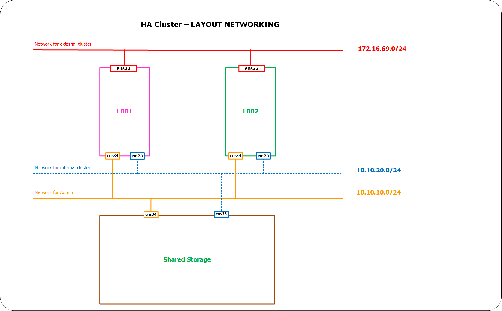
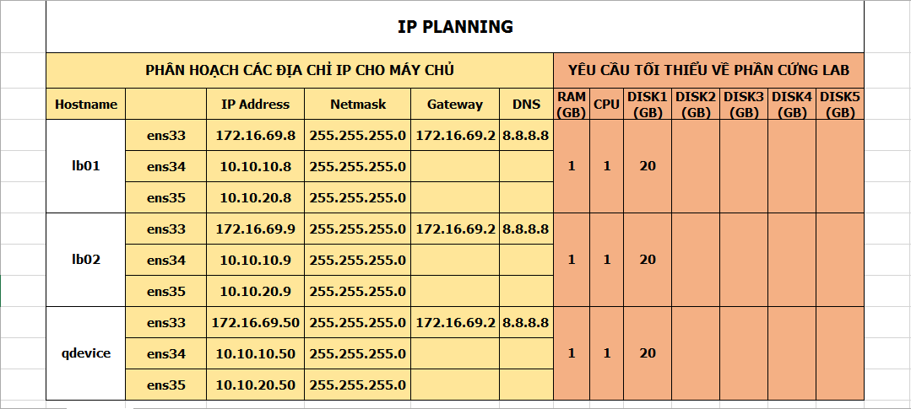
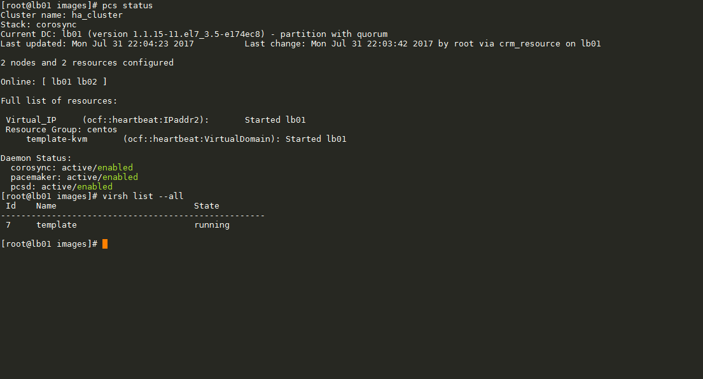

# F. Cấu hình NFS trên 1 node chia sẻ dữ liệu cho các KVM trong Cluster

____

# Mục lục

- [F.1 Yêu cầu giải quyết](#issue)
- [F.2 Mô hình triển khai](#models)
- [F.3 Cài đặt KVM](#kvm-settings)
- [F.4 Triển khai, cấu hình NFS](#nfs)
- [F.5 Tạo resources quản lý KVM](#resource)
- [F.6 Kiểm tra kết quả](#stat)
- [Các nội dung khác](#contents-other)
____

# Nội dung

- ### <a name="issue">F.1 Yêu cầu giải quyết</a>

	- Bài toán giải quyết vấn đề chia sẻ dữ liệu cho các KVM trong Cluster có thể sử dụng chung các dữ liệu với nhau.

- ### <a name="models">F.2 Mô hình triển khai</a>

	- Mô hình hệ thống:

		

	- Địa chỉ IP cấp phát cho các node:

		

	- Môi trường triển khai:

			- OS: Centos 7
			- username: root
			- Hệ thống: Với 2 node lb01, lb02 nằm trong cùng 1 cluster

- ### <a name="kvm-settings">F.3 Cài đặt KVM</a>

	- Sau khi thực hiện cấu hình cluster cho 2 node lb01, lb02 (Xem hướng dẫn tại đây)(pacemaker-corosync-installing.md). Ta cần thực hiện cài đặt KVM trên hai node lb01 và lb02. Để cài đặt, ta sử dụng câu lệnh:

			yum install -y qemu-kvm libvirt virt-install bridge-utils

	- Sau khi cài đặt thành công, tại node lb01, ta tiến hành tạo máy ảo với các câu lệnh sau (bạn có thể bỏ qua bước này):
			
			mkdir /var/qemu-kvm
			mkdir /var/qemu-kvm/images
			virt-install \
			--name centos7 \
			--ram 1024 \
			--disk path=/var/qemu-kvm/images/centos7.img,size=10 \
			--vcpus 1 \
			--os-type linux \
			--os-variant rhel7 \
			--network bridge=virbr0 \
			--graphics none \
			--console pty,target_type=serial \
			--location 'http://ftp.iij.ad.jp/pub/linux/centos/7/os/x86_64/' \
			--extra-args 'console=ttyS0,115200n8 serial'

- ### <a name="nfs">F.4 Triển khai, cấu hình NFS</a>

	- __ Thực hiện các bước sau trên node qdevice__:

		Bước 1: Cài đặt nfs-utils:

			yum install -y nfs-utils

		Bước 2: Cấu hình NFS server:

			vi /etc/idmapd.conf

		sau đó bỏ comment dòng thứ 5 và sửa thành:

			Domain = qdevice

		Bước 3: Tạo cấu hình chỉ định chia sẻ thư mục

			vi /etc/exports

		thêm nội dung sau vào file sau đó lưu lại:

			/kvmpool 10.10.10.0/24(rw,no_root_squash)

			trong đó:

				- /kvmpool: là thư mục được chia sẻ
				- 10.10.10.0/24: là dải mạng cho phép được truy cập để chia sẻ thư mục /kvmpool
				- (rw,no_root_squash): Quyền truy cập

		tạo thêm thư mục để chia sẻ:

			mkdir /kvmpool

		Bước 4: Khởi động dịch vụ NFS server.

			systemctl start rpcbind nfs-server 
			systemctl enable rpcbind nfs-server 

	- __Thực hiện các bước sau trên cả hai node lb01 và lb02__:

		Bước 1: Tiến hành chạy câu lệnh sau để đơn giản hóa cho việc cấu hình các phần sau:

			echo "10.10.10.50 qdevice" >> /etc/hosts
		
		Bước 2: Cài đặt nfs-utils:

			yum install -y nfs-utils

		Bước 3: Cấu hình NFS client:

			vi /etc/idmapd.conf

		sau đó bỏ comment dòng thứ 5 và sửa thành:

			Domain = qdevice
		
		Bước 4: Khởi động dịch vụ:

			systemctl start rpcbind 
			systemctl enable rpcbind 

		Bước 5: Thực hiện ánh xạ thư mục chia sẻ:

			mkdir /kvmpool
			mount -t nfs qdevice:/kvmpool /kvmpool

		Bước 6: Cấu hình NFS mounting khi system boots:

			vi /etc/fstab

		thêm dòng sau vào cuối file và lưu lại:

			qdevice:/kvmpool  /kvmpool                   nfs     defaults        0 0

		Bước 7: Cấu hình auto-mouting khi khởi động hệ thống:

		Bước 7.1: Cài đặt autofs:

			yum -y install autofs

		Bước 7.2: Thực hiện cấu hình:

			vi /etc/auto.master

		thêm vào nội dung sau vào cuối file và lưu lại:

			/-    /etc/auto.mount

		tiếp theo, tạo file `/etc/auto.mount` với nội dung file

			echo "/kvmpool -fstype=nfs,rw  qdevice:/kvmpool" >> /etc/auto.mount

		Bước 8: Khởi động dịch vụ:

			systemctl start autofs 
			systemctl enable autofs 

- ### <a name="resource">F.5 Tạo resources quản lý KVM</a>

	- Bước 1: Tạo thư mục `qemu_config` và `images` cho KVM lưu trữ dữ liệu trên thư mục chia sẻ:

			mkdir /kvmpool/qemu_config
			mkdir /kvmpool/images

	- Bước 2: Copy file `*.xml` chứa thông tin của máy ảo đã tạo ở bước trên trong thư mục `/etc/libvirt/qemu` hoặc sử dụng file [`template`](https://raw.githubusercontent.com/BoTranVan/ghichep-pacemaker-corosync/master/files/template.xml) nếu bạn đã bỏ qua bước tạo máy ảo ở phía trên tới thư mục `/kvmpool/qemu_config`. Giả sử, tôi sử dụng lại file `template.xml`. Tôi cần tạo thêm một file `*.img` để có thể cài đặt máy ảo lên:

			qemu-img create -f qcow2 /kvmpool/images/template.img 10G

			- chỉ thực hiện trên lb01 hoặc lb02.

	- Bước 3: Tiến hành tạo resource để cluster quản lý:

			pcs resource create template-kvm VirtualDomain \
			hypervisor="qemu:///system" \
			config="/kvmpool/qemu_config/template.xml" \
			migration_transport=ssh \
			op start timeout="120s" \
			op stop timeout="120s" \
			op monitor  timeout="30" interval="10"  \
			meta allow-migrate="true" priority="100" \
			op migrate_from interval="0" timeout="120s" \
			op migrate_to interval="0" timeout="120" \
			--group centos

- ### <a name="stat">F.6 Kiểm tra kết quả</a>

	- Sử dụng câu lệnh sau để kiểm tra kết quả:

			pcs status
			virsh list --all

	ta được kết quả tương tự như hình sau:

	

	- Có thể, trong lần chạy đầu tiên với câu lệnh `pcs status` có thể thông báo lỗi, hãy cứ chạy câu lệnh sau cho đến khi không còn thông báo:

			pcs resource cleanup

____

# <a name="contents-other">Các nội dung khác</a>

- [E. Thực hiện cấu hình tạo cluster với chế độ active/active](master-resource-pcmk.md)
	- [E.1 Cài đặt pacemaker và tạo nginx.](master-resource-pcmk.md#install)
	- [E.2 Cấu hình resource](master-resource-pcmk.md#configure)
		- [E.2.1 Sử dụng câu lệnh](master-resource-pcmk.md#cmd)
		- [E.2.2 Sử dụng giao diện website](master-resource-pcmk.md#gui)
		- [E.2.3 Khởi động lại dịch vụ trong cluster](master-resource-pcmk.md#star)
